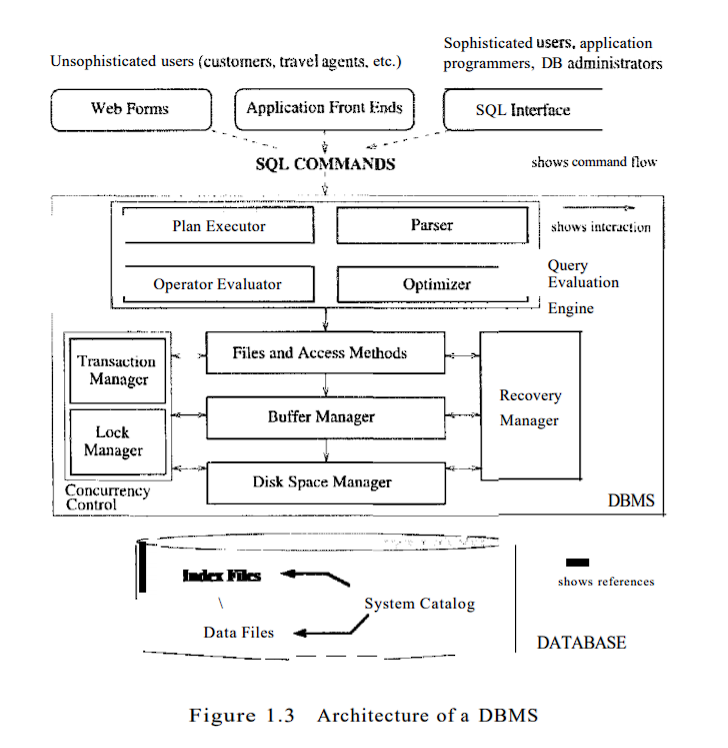

# Extending a Relational Database ( CSE 510: DBMSI)

The project deals with adding layers on top of the implementation of relational database "<a href="https://research.cs.wisc.edu/coral/minibase/minibase.html" >minibase</a>". The base implementation only contains bare minimum features for a database to work. So it has File System (Heap files, Index files), Indexing (b-tree index), Buffer Manager and Disk Manager implemented.

####Our goal is to use these modules of MiniBase as building blocks for implementing a user preference sensitive DBMS to:
<ol>
 <li>Support e-commerce application for user preference sensitive: Skyline.</li>
 <li>Add skyline operators. Use different algorithm to compare the working of each algorithm. </li>
 <li>Implement Clusteres B-tree index, Hash based clustered & un-clustered index, GroupBy, Join Operator (index nested & hash join), top-K join (NRA & hash)  </li>
 <li>Implement a Database Catalog along with interface to perform the database operations.</li>
</ol>
 

####Reports on implementation of the above goals in three phase:
<ul>
<li><a href="Phase_1/typescript">This document</a> provides information on system working and some operation that the base implementation supports.</li>
<li><a href="Phase_2/phase2.pdf">This document</a> provides information on implementation of skyline operator and different algorithms used.</li>
<li><a href="Phase_3/pahse3.pdf">This document</a> provides information about implementation of other features (join, groupby & index) along with database catalog implementation.</li>
</ul>

## References
1. Ramakrishnan, Gehrke, "Database Management Systems"
2. S. Borzsony, D. Kossmann and K. Stocker, ”The Skyline operator,” Proceedings 17th International Conference on Data Engineering, Heidelberg, Germany, 2001, pp. 421-430, doi: 10.1109/ICDE.2001.914855.
3. Chomicki J., Godfrey P., Gryz J., Liang D. (2005) Skyline with Presorting: Theory and Optimizations. In: Kopotek M.A., Wierzcho S.T., Trojanowski K. (eds) Intelligent Information Processing and Web Mining. Advances in Soft Computing, vol 31. Springer, Berlin, Heidelberg. https://doi.org/10.1007/3-540-32392-9_72
4. K.L. Tan, P.K. Eng and B. C. Ooi. “Efficient Progressive Skyline Computation.” 27th Int. Conference on Very Large Data Bases (VLDB), Roma, Italy, 301-310, September 2001.
5. M. Nagendra, “Efficient Processing of Skyline Queries on Static Data Sources, Data Streams and Incomplete Datasets,” Arizona State University, 2014. https://repository.asu.edu/items/27470
6. Rudenko L., Endres M. (2018) Real-Time Skyline Computation on Data Streams. In: Benczúr A. et al. (eds) New Trends in Databases and Information Systems. ADBIS 2018. Communications in Computer and Information Science, vol 909. Springer, Cham. https://doi.org/10.1007/978-3-030-00063-9_3
7. K Ramamohanarao and R Sacks-Davis. 1984. Recursive linear hashing. ACM Trans. Database Syst. 9, 3 (Sept. 1984), 369–391. DOI:https://doi.org/10.1145/1270.1285
8. Ilyas, Ihab & Aref, Walid & Elmagarmid, Ahmed. (2004). Supporting top-k join queries in relational databases. The VLDB Journal. 13. 10.1007/s00778-004-0128-2.
9. Function Based Index, Oracle 11.2 documentation, https://docs.oracle.com/cd/E11882_01/appdev.112/e41502/adfns_indexes.htm#ADFNS00505
10. Goncalves M., Vidal ME. (2005) Top-k Skyline: A Unified Approach. In: Meersman R., Tari Z., Herrero P. (eds) On the Move to Meaningful Internet Systems 2005: OTM 2005 Workshops. OTM 2005. Lecture Notes in Computer Science, vol 3762. Springer, Berlin, Heidelberg. https://doi.org/10.1007/11575863_99